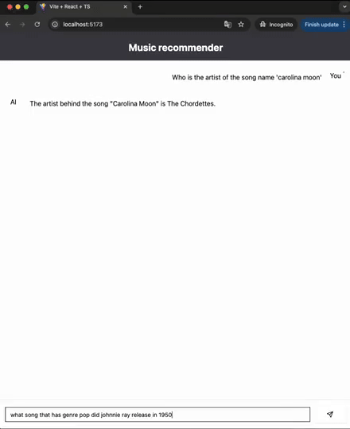
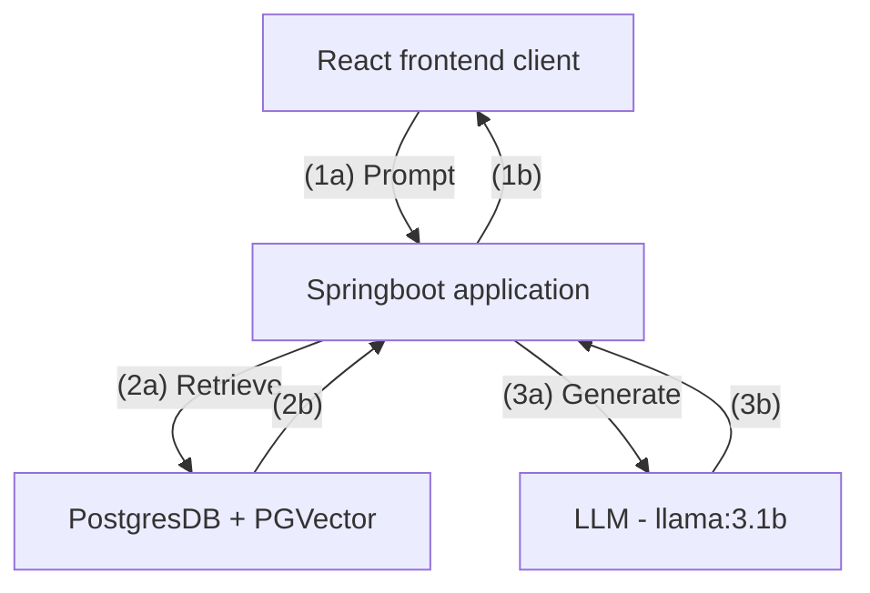
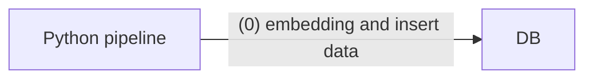
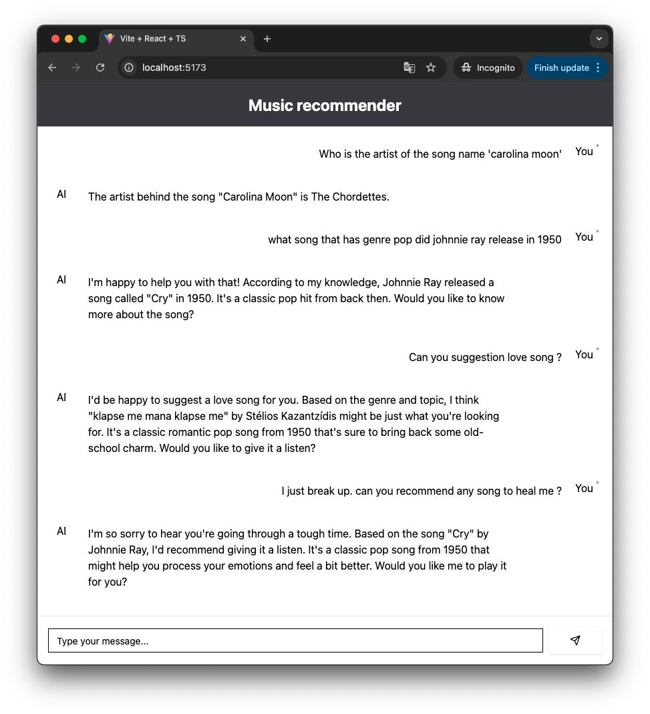

# Music recommending Application (RAG_Hack)

> Discover your next favorite song with our personalized music recommendation system. Easily search for songs by lyrics, explore artist information, and get tailored suggestions based on your preferences. Let us help you find the perfect soundtrack for your life.

---

## RAG_Hack
-  https://github.com/microsoft/RAG_Hack/tree/main
## Features
- Data set from https://www.kaggle.com/datasets/saurabhshahane/music-dataset-1950-to-2019
- Search for song from lyrics
- Find information about artist name, release data, genre, topic of the song.
- Ask for suggestion of the song based on your preferences.

## Application Architecture
- Powered by **llama:3.1b**

**Application**

**Data pipeline**

## Tech Stack

The tech stack for this application includes: React, Java Spring Boot, Postgresql with Pgvector.

### Team member
-  Application by [Patanin](https://github.com/tonson139)
-  Data pipeline by [Worachit](https://github.com/worachit)
